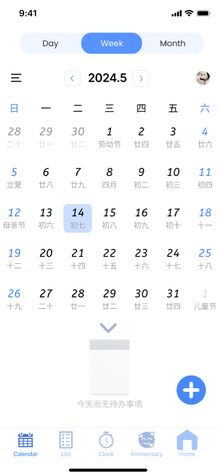

# Calendar Design Documentation

## 1 内容分析

### 1.1 场景描述

#### 1.1.1 设计背景

随着工作和生活节奏的加快，人们需要更有效的方式来管理自己的时间和任务。现代生活中，我们面临着各种各样的任务和日程，从工作会议、家庭聚会到个人兴趣爱好等。这款时间管理系统的设计初衷是提供一个集成化的解决方案，帮助用户有效规划和追踪日常活动，提高日常工作生活效率。

#### 1.1.2 目标用户群体

本时间管理系统主要面向以下用户：

* **职场人士**：需要管理工作任务、会议和紧急项目
* **学生**：需要规划学习时间、作业和考试

#### 1.1.3 使用场景

* **任务规划与提醒**：用户可以在系统中设定各种任务（工作任务、个人事务等）和提醒，确保不错过任何重要事件
* **日程管理**：通过日历视图，用户可以轻松查看和管理自己的日常安排，包括工作会议、私人约会和其他重要活动
* **专注时间管理**：使用番茄钟等技术帮助用户保持专注，通过设定工作和休息的间隔时间，提高工作效率
* **特殊日期和纪念日提醒**：帮助用户记住重要的个人和家庭纪念日，如生日、纪念日和其他重要场合

#### 1.1.4 用户体验目标

* **简洁易用**：界面直观，用户能够迅速学会如何使用系统
* **个性化设置**：用户可以根据自己的喜好和需求调整界面设置和提醒方式
* **高效管理**：系统支持多种视图和工具，帮助用户高效管理时间和任务

### 1.2 需求分析

#### 1.2.1 功能需求分析

1. **日历管理**
   * 支持查看和编辑日、周、月视图
   * 能够显示公历、农历以及重要的节假日信息
   * 提供事件添加、编辑和删除功能

2. **任务与待办事项管理**
   * 允许用户添加、编辑和删除任务和待办事项
   * 支持设置截止日期和提醒
   * 支持任务优先级标记和分类管理

3. **提醒和通知**
   * 用户可以为任何任务或事件设置提醒
   * 支持多种提醒方式，包括应用内通知、电子邮件或短信提醒

4. **番茄钟和专注模式**
   * 提供番茄钟工具，帮助用户通过设定工作和休息的时间间隔来管理专注时间
   * 允许用户自定义工作和休息的时间长度

5. **纪念日和特殊日期管理**
   * 允许用户添加和管理纪念日和其他特殊日期
   * 支持纪念日的倒数日提醒

6. **个性化设置和同步**
   * 支持用户自定义界面主题、字体大小和通知声音
   * 数据同步功能，确保在不同设备间用户数据的一致性

#### 1.2.2 可用性需求分析

* **界面友好**：界面应简洁明了，容易导航，适合所有技术熟练度的用户
* **多语言支持**：应用应支持多种语言，以满足不同地区用户的需求
* **无障碍访问**：提供高对比度模式、文字到语音等无障碍功能，确保所有用户都能方便使用

### 1.3 主要竞争产品分析

#### 1.3.1 Google Calendar

**功能特点：**

* 集成电子邮件和日历功能
* 支持跨平台同步
* 提供日、周、月视图
* 可以添加视频会议链接和地点

**用户反馈：**

* 用户赞赏其简洁的界面和高度的集成性
* 部分用户反映在移动设备上操作复杂
* 缺乏一些个性化和高级功能，如任务优先级标记

#### 1.3.2 Microsoft Outlook

**功能特点：**

* 电子邮件和日历紧密集成
* 支持会议室预订等企业功能
* 高级邮件和日历管理功能

**用户反馈：**

* 企业用户高度评价其专业性和可靠性
* 普通用户可能会因复杂性和过多的企业功能感到不便

#### 1.3.3 Todoist

**功能特点：**

* 强大的任务管理功能
* 支持任务分类和优先级设置
* 可集成其他应用，如Google Drive和Slack

**用户反馈：**

* 用户喜爱其灵活的任务管理和丰富的集成选项
* 部分用户认为价格略高

### 1.4 预期效果

#### 1.4.1 界面设计与用户体验

1. **直观的用户界面**
   * 设计简洁、直观的用户界面，使用户能够在没有任何培训的情况下快速上手
   * 重要功能如添加、编辑和删除事件或任务都能轻易访问，通过显眼的按钮和图标展示

2. **响应式布局**
   * 确保应用在不同设备（如手机、平板、笔记本电脑）上均具有良好的显示效果
   * 自动调整布局以适应屏幕大小，保持内容的可读性和操作的便利性

3. **美观的视觉风格**
   * 使用现代、简约的设计风格，配以舒适的颜色方案和优雅的字体，提升视觉体验
   * 设计元素和颜色差异用于突出显示重要信息和提醒，如使用不同颜色标记不同类型的事件或任务

#### 1.4.2 功能实用性

1. **日历和事件管理**
   * 提供多种视图（日、周、月）以适应不同的时间管理需求
   * 支持快速添加事件的功能，例如通过双击日期或使用快速输入栏

2. **任务和待办事项**
   * 功能丰富的待办事项列表，支持拖放重新排序、优先级标记和自定义分类
   * 集成智能提醒，根据用户习惯和历史行为自动提出建议时间

3. **专注时间管理（番茄钟）**
   * 番茄钟功能帮助用户通过设定专注和休息时间来管理工作周期，增加工作效率
   * 提供定制选项，允许用户根据个人习惯调整时间长度和休息间隔

4. **纪念日和特殊事件提醒**
   * 自动提醒用户重要的纪念日和事件，如生日和纪念日。
   * 支持倒数日功能，帮助用户计划和准备即将到来的重要日子。

## 2 功能生成

### 2.1 功能流程设计

1. **登录界面：**
   输入用户名和密码 → 点击登录按钮 → 系统验证凭证后进入主界面（默认日历界面） → 提供找回密码和游客访问选项

2. **日历界面：**
   查看不同月份的日历 → 点击特定日期查看或添加事件 → 切换视图（日、周、月） → 添加新事件按钮快速添加

3. **待办事项界面：**
   查看全部待办事项清单 → 添加新的待办事项 → 完成待办事项后勾选完成 → 编辑或删除已有的待办事项

4. **纪念日界面：**
   查看所有纪念日 → 添加新的纪念日 → 设置纪念日倒计时提醒 → 编辑或删除纪念日

5. **番茄钟界面：**
   设置工作和休息时间 → 开始计时 → 系统提醒休息或继续工作 → 取消或重设计时器

### 2.2 关键任务执行路径

**日常任务管理**

从日历界面选择日期查看当日待办事项 → 进入待办事项界面，添加或修改任务 → 使用番茄钟设置工作专注时间 → 查看纪念日界面

### 2.3 关键任务场景和故事板设计

## 3 设计过程

### 3.1 设计平台

* 操作系统：Windows 11
* 设计平台：[Figma](https://www.figma.com)

### 3.2 设计理念

为了设计一款以时间管理为核心，兼容日历、待办记事、计时器和倒数日的功能实用、操作灵活易用的**移动端**任务提醒和时间管理系统，我们的设计理念如下，这些设计理念将确保应用不仅美观、符合现代审美，而且高效易用，满足不同用户群体的需求。

#### 3.2.1 设计风格

* **简约现代**：采用极简主义的设计风格，减少视觉干扰，提升用户体验。使用简单的图标和少量关键的文字，帮助用户快速理解功能，从而快速上手
* **扁平化设计**：界面元素采用扁平化设计，避免过多的装饰性元素，界面更加清新和现代。这种风格有助于提升加载速度和操作的流畅性，非常适合移动设备
* **一致性**：整个应用的设计风格在不同的页面和功能模块之间保持一致，确保用户在使用过程中的舒适感和连贯感

#### 3.2.2 布局设计

* **焦点清晰**：确保每个页面的核心功能焦点突出，如在日历页面突出日期选择，在待办事项页面突出任务列表
* **导航简洁**：采用底部导航栏，固定包含“日历”、“待办”、“番茄钟”和“纪念日”等主要功能按钮，便于用户在不同功能间快速切换
* **交互便捷**：设计考虑到手指的触达区域，将常用功能按钮放置在屏幕下方或容易触达的位置，减少单手操作的难度

#### 3.2.3 配色方案

* **柔和色调**：使用温和的蓝色和灰色调作为主色调，创造一个舒适的视觉体验。这些颜色能够减轻眼睛的疲劳，适合长时间使用
* **情感色彩**：在特定功能如纪念日或重要任务提醒中，采用温馨或提醒性较强的颜色，如红色或粉色，帮助用户在情感上与应用建立联系

#### 3.2.4 可访问性

* **字体清晰**：确保文字大小适中，字体清晰，用户在不同的设备上阅读无压力
* **无障碍支持**：提供无障碍功能，如语音读出、放大字体等，保证所有用户群体都能舒适使用

### 3.3 原型界面设计

#### 3.3.1 登陆和注册界面

在设计登录和注册界面时，我们致力于设计一个既美观又实用的用户入口，以增强用户体验和安全性。这些界面不仅要响应不同设备的显示需求，还需提供多种便捷的登录和注册选项，满足不同用户的需求。

**登陆和注册界面设计思路如下：**

1. **响应式设计与用户便捷性**：为提升用户体验，登录界面采用响应式设计，确保在不同设备和屏幕尺寸下都能良好显示。输入框设计成自动聚焦，用户打开页面后即可直接输入信息，提高了操作的便捷性。

2. **多种登录方式**：为满足不同用户的需求，系统提供多种登录方式。用户可以选择使用谷歌账号快捷登录，或通过注册新账号的方式登录系统。如果用户希望先体验系统功能，也可以选择游客登录，快速了解系统的基本功能。

3. **注册方式**：注册界面支持邮箱或手机号码注册，通过获取验证码即可完成注册。注册后，用户仍需设置密码以增强账户的安全性。

4. **视觉设计与品牌认知**：为了吸引用户并提升品牌认知度，登录界面在视觉设计上注重统一性和美观性。页面整体风格与时间管理系统的其他部分保持一致，采用一致的色调和品牌标识。背景图和插图不仅提升了页面的视觉效果，还传递出时间管理和高效工作的主题，增强了品牌的专业形象。

5. **安全性与隐私保护**：安全性是登录界面的重要考虑因素。我们将会采用SSL加密技术，确保用户信息在传输过程中的安全性。为防止暴力破解，系统在多次登录尝试失败后将触发验证码机制。用户密码以哈希形式存储，进一步保障数据的安全。

**登陆界面设计展示如下：**

**注册界面设计展示如下：**

#### 3.3.2 日历界面

日历界面是时间管理系统的核心部分，设计一个用户友好、功能丰富且美观的日历界面至关重要。我们的设计目标是提供一个直观、易用的界面，帮助用户有效地管理和规划时间。

**日历界面设计思路如下：**

1. **响应式设计与用户便捷性**：为提升用户体验，日历界面采用响应式设计，确保在不同设备和屏幕尺寸下都能良好显示。用户可以在日、周、月视图之间自由切换，满足不同时间管理需求。界面上的每个日期均可点击查看详情，提高了操作的便捷性和数据的可访问性。

2. **多功能集成**：日历界面集成了多种功能，用户可以直接在日历上添加、编辑和删除事件。右下角的“添加”按钮（+号）设计为显眼的蓝色，方便用户快速添加新事件。日历界面还显示了农历日期和节假日信息，帮助用户更全面地了解和管理时间。

3. **视觉设计与品牌认知**：为了吸引用户并提升品牌认知度，日历界面在视觉设计上注重统一性和美观性。页面整体风格与时间管理系统的其他部分保持一致，采用一致的色调和品牌标识。每个日期框内的信息排布简洁明了，重要日期和节假日用不同颜色标注，使用户一目了然。

**日历界面设计展示如下：**

#### 3.3.3 待办界面

待办事项界面是时间管理系统的重要组成部分，旨在帮助用户有效地管理任务和提升工作效率。我们在设计该界面时，注重简洁性、功能性和用户体验，确保用户能够轻松地查看、添加和管理他们的待办事项。

**待办界面设计思路如下：**

1. **响应式设计与用户便捷性**：待办事项界面采用响应式设计，确保在不同设备和屏幕尺寸下都能良好显示。界面设计简洁明了，主要包括任务列表、搜索框和添加按钮。用户可以通过搜索框快速查找特定任务，右下角显眼的“添加”按钮（+号）则方便用户快速添加新任务。

2. **多功能集成**：待办事项界面提供多种功能，用户可以直接在界面上勾选完成任务、查看任务详情和截止日期。每个任务项前面的复选框设计便于用户快速标记任务完成情况，清晰的任务编号和截止日期帮助用户更好地管理时间和任务优先级。

3. **视觉设计与品牌认知**：为了吸引用户并提升品牌认知度，待办事项界面在视觉设计上注重统一性和美观性。页面整体风格与时间管理系统的其他部分保持一致，采用一致的色调和品牌标识。每个任务项的信息排布简洁有序，使用户在查看和管理任务时更加方便。

**待办界面设计展示如下：**

#### 3.3.4 番茄钟界面

番茄钟界面是时间管理系统中的一个关键功能，旨在帮助用户提高专注力和工作效率。设计一个直观、易用且美观的番茄钟界面对于用户的时间管理至关重要。我们的设计目标是提供一个简洁、友好且功能全面的界面，帮助用户高效利用时间。

**番茄钟界面设计思路如下：**

1. **响应式设计与用户便捷性**：为提升用户体验，番茄钟界面采用响应式设计，确保在不同设备和屏幕尺寸下都能良好显示。界面布局简单明了，用户可以通过直观的操作轻松设置计时器。界面包括时间选择器、开始按钮和取消按钮，确保用户能够快速启动和管理计时。

2. **直观的时间选择**：番茄钟界面采用钟表式和数字式结合的时间选择器，用户可以通过拖动指针或直接输入时间来设置计时器。这种设计既符合用户的操作习惯，又能提高设置的准确性和便捷性。AM/PM切换按钮方便用户设置上午或下午的时间。

3. **视觉设计与品牌认知**：为了吸引用户并提升品牌认知度，番茄钟界面在视觉设计上注重统一性和美观性。页面整体风格与时间管理系统的其他部分保持一致，采用一致的色调和品牌标识。时间选择器和按钮采用清晰的蓝色，确保用户在操作时能够一目了然。

**番茄钟界面设计展示如下：**

#### 3.3.5 纪念日界面

纪念日界面是时间管理系统中的一个重要功能，帮助用户记录和管理各种重要日期和纪念日。设计一个简洁、美观且易用的纪念日界面，有助于用户随时掌握重要日期，并为其提供提醒服务。

**纪念日界面设计思路如下：**

1. **响应式设计与用户便捷性**：为提升用户体验，纪念日界面采用响应式设计，确保在不同设备和屏幕尺寸下都能良好显示。界面布局简洁明了，用户可以直观地查看和添加纪念日。通过显眼的“添加”按钮（+号），用户可以快速添加新纪念日。

2. **直观的日期展示**：纪念日界面以卡片形式展示每个纪念日的详细信息，包括日期、事件描述和倒计时天数。主要纪念日以大号字体和醒目的颜色显示，帮助用户一目了然地掌握重要信息。同时，界面上方展示的总天数提供了对特定纪念日的直观概览。用户也可以更换别的纪念日为置顶使之更加明显。

3. **视觉设计与品牌认知**：为了吸引用户并提升品牌认知度，纪念日界面在视觉设计上注重统一性和美观性。页面整体风格与时间管理系统的其他部分保持一致，采用一致的色调和品牌标识。每个纪念日卡片的设计简洁美观，通过不同颜色区分事件类型，使界面更具层次感。

**纪念日界面设计展示如下：**

#### 3.3.6 个人主页界面

个人主页界面是时间管理系统中的中心控制面板，用户可以在此管理个人信息、查看系统统计数据以及进行各种设置。设计一个简洁、功能全面且用户友好的个人主页界面，有助于用户更好地管理和优化其时间管理体验。我们的设计目标是提供一个直观、便捷且高效的界面。

**个人主页界面设计思路如下：**

1. **响应式设计与用户便捷性**：为提升用户体验，个人主页界面采用响应式设计，确保在不同设备和屏幕尺寸下都能良好显示。界面布局合理，主要功能模块清晰展示，用户可以轻松找到所需的设置和信息。顶部的用户头像和姓名区域让用户感到界面的个性化和专属感。

2. **直观的信息展示**：个人主页界面直观地展示了用户的关键统计数据，如创建的日程、完成的待办事项和好友数量。每个数据模块均采用简洁明了的设计，帮助用户快速了解其时间管理情况。基础设置和小组件区域通过图标和文字组合展示，便于用户快速导航和操作。

3. **视觉设计与品牌认知**：为了吸引用户并提升品牌认知度，个人主页界面在视觉设计上注重统一性和美观性。页面整体风格与时间管理系统的其他部分保持一致，采用一致的色调和品牌标识。图标设计简洁美观，界面布局层次分明，使用户在使用时能够获得良好的视觉体验。

4. **数据同步与安全性**：个人主页界面支持与用户的其他设备和账号进行数据同步，确保用户无论在何处都能访问和管理其设置信息。所有数据将均通过SSL加密技术传输，确保用户信息的安全性。系统会定期备份用户数据，防止数据丢失。

5. **用户自定义选项**：为满足不同用户的个性化需求，个人主页界面提供丰富的自定义选项。用户可以在基础设置中调整界面风格、语言和提醒方式，并可以通过小组件区域添加或删除个性化工具。这些功能确保每个用户都能根据自己的使用习惯和偏好定制界面，提高使用体验。

**个人主页界面设计展示如下：**

## 4 操作流程

**应用的操作流程如下：**

1. **登陆注册界面**：用户点击 **Sign in** 即可进入首页（即日历界面）。如果没有账户，可以点击下方小字 **register** 进入注册界面，或者使用游客登陆。

2. **日历界面**：日历界面是登录之后的默认首页，显示的是当月日历，会显示阳历、农历和节假日信息；同时下拉还可以查看当日是否有未完成的待办事项。右下角的 **"+"** 可以添加待办事项。上排 **Day / Month / Year** 设计可以切换视图。同时左右箭头可以切换日期/月份/年份。

3. **待办事项界面**：待办事项界面按照时间排序汇总所有的待办事项。右下角的 **"+"** 可以添加待办事项。上方可以 **搜索** 或者 **筛选** 。

4. **番茄钟界面**：番茄钟界面作为一个较为独立的特色功能，用于使用户更好的管理时间。该钟用于设置截至提醒时间。用户可以通过拨动指针，或修改时钟上方的时间来设置。点击下方 **OK** 按钮设置。在中途若想取消也可以点击下方 **Cancel** 取消。

5. **纪念日界面**：纪念日界面也是一个较为独立的特色功能，可以计算正数/倒数日。用户可以选择将一个倒数日置顶显示，即图上方的纪念日。置顶显示的纪念日横排显示时右侧为粉色。正数日为蓝色，倒数日为紫色。右下角的 **"+"** 可以添加纪念日。

6. **创建待办事项界面**：用户可以添加事项并选择日期、截止时间和提醒时间以及标记该事件的属性。添加完毕后会存入日历界面和待办事项界面。

7. **创建纪念日界面**：用户可以添加纪念日并选择日期和提醒时间并标记属性。系统会自动判断为正数日或倒数日。

8. **个人主页界面**：个人主页包含头像、姓名和一些基本按键。基本设置可以调整日/夜间模式、统计数据、个性化设置等。我们预留了小组件部分以待后续开发完善。

## 5 应用展示

### 5.1 总体展示

### 5.2 登录展示

### 5.3 注册展示

### 5.4 访客模式展示

## 6 设计评估

### 6.1 设计优势评估

#### 6.1.1 功能评估

1. **多功能集成**

   * 应用集成了日历、待办事项列表、纪念日记录和提醒等功能，使用户可以在一个平台上管理所有与时间相关的任务。这种一体化的设计提供了极大的便利性，减少了切换不同应用的需求。

2. **多种登录选项**

   * 灵活性与便利性：提供邮箱密码登录及Google账号登录两种方式，增强了系统的灵活性和便利性。对于希望快速访问服务的用户，Google单点登录（SSO）是一个非常便捷的选项，它简化了注册和登录过程，减少了用户记忆多个密码的负担。

   * 满足不同用户需求：不同的用户可能有不同的偏好或需求对于隐私和安全的考虑。提供多种登录方式可以覆盖更广泛的用户群体，特别是那些对于使用社交账户登录持保留态度的用户。

3. **明确的注册和访客登录选项**

   * 增加用户参与度：通过明确展示“注册新账号”和“访客登录”两种选项，可以有效引导新用户进行注册，也为只想临时访问的用户提供了便捷路径。这种设计考虑了不同用户的参与意愿和使用习惯，有助于提升用户的整体参与度和满意度。

   * 提高转化率：清楚地区分注册和访客登录可以减少用户在使用初期的退出率。对于尚未决定是否长期使用服务的用户，可以无压力地先以访客身份体验应用，这种低风险的试用方式可能会更容易转化为正式注册用户。

4. **自定义提醒功能**

   * 提供强大的自定义提醒功能，用户可以为不同的任务和事件设定特定的提醒时间和方式。这帮助用户保持任务的按时完成，并有效管理他们的日程安排。

5. **响应式设计**

   * 应用针对不同设备进行了优化，无论是在手机、平板还是桌面设备上都能提供良好的用户体验。这种响应式设计确保了应用的广泛可用性和易访问性。

#### 6.1.2 用户交互评估

1. **简单明了的界面设计**

   * 用户体验优化：该系统采用了极简的界面设计，减少了过多的视觉元素，可以快速引导用户关注于核心功能，即登录操作。这种设计遵循了用户界面设计的最佳实践，即"少即是多"，有助于提高用户的操作效率。

   * 界面可用性：清晰的布局有助于减少用户的认知负担，用户可以无需额外指导即可自行完成登录流程。适用于各年龄层和技术熟练度的用户，特别是在移动设备上查看时也能保持良好的可读性和易用性。

2. **便捷的时间选择工具**

   * 时间选择界面以创新和直观的方式实现，例如使用旋转式时钟选择器，使用户可以以自然且直观的方式选择时间，提高了操作的趣味性和效率。

3. **高效的信息组织和呈现**

   * 应用在信息组织和呈现方面表现出色，如待办事项和日历事件都清晰地分类和显示，使用户能够快速浏览和获取所需信息。

### 6.2 设计劣势评估

#### 6.2.1 功能评估

1. **功能种类多却简**

   * 即使应用集成了多种功能，但每个功能可能缺少足够的定制化选项来满足不同用户的具体需求，使得功能虽广泛但不够深入。

   * 功能众多可能导致界面拥挤，特别是在移动设备上，用户可能难以快速找到所需功能，影响使用体验，造成界面过载问题。

2. **应用重复**

   * 应用中可能存在功能重复，特别是在时间管理和提醒设置方面，这不仅占用资源，也可能造成用户混淆。需要进一步优化，找到重复功能的共同点和不同点。

3. **登录方式不够全面**

   * 应该设置最基础的找回密码、忘记密码等功能，同时登陆方式应该多样化。

#### 6.2.2 用户交互评估

1. **复杂的日期输入方式**

   * 在创建事件或任务时，日期和时间的输入方式需要多步操作，可能会影响用户体验的流畅性。

2. **不能更好显示任务优先级**

   * 本应用的待办事项通过任务时间顺序排序，这不能更好的显示任务优先级。由于考虑到已设有设置提醒时间以及区分待办性质的选项，故还没有处理好显示任务优先级的交互方式，这也许会使得界面混乱，实用性变差。

### 6.3 改进方法

1. 应用拥有丰富的功能集成，这是一个巨大的优势。为了解决功能多而不深的问题，可以通过加强每个功能的定制化和深度来提升用户体验。例如，在待办事项和日历功能中加入更多的自定义视图和过滤选项，允许用户根据项目的优先级、截止日期或个人标签进行管理。同时，可以增强自定义提醒功能，使其支持更多的个性化选项，如定制提醒音、位置触发提醒等，以适应用户的具体需求。

2. 在交互设计方面，由于已经拥有简洁明了的界面和高效的信息组织方式，这些优势可以用来改进现有的用户界面交互。对于复杂的日期输入方式，可以通过引入更直观的日历控件和时间选择器来简化操作。此外，增加明显的视觉和触觉反馈，如按钮按下效果和动画过渡，可以帮助用户更清楚地了解他们的操作结果。这不仅提高了界面的友好性，还能减少用户的操作误解。

3. 对于功能重复和界面过载的问题，可以通过合并相似功能和优化界面布局来解决。这包括剔除低使用频率的功能，优化核心功能的访问方式，以及重新设计用户界面，使其更加集中和易于访问。同时，考虑到应用已经支持多种登录选项，进一步增强这一点，如添加更多的社交媒体登录选项，可以提高应用的可访问性和用户便利性。

## 7 文档更新日期

2024年6月10日