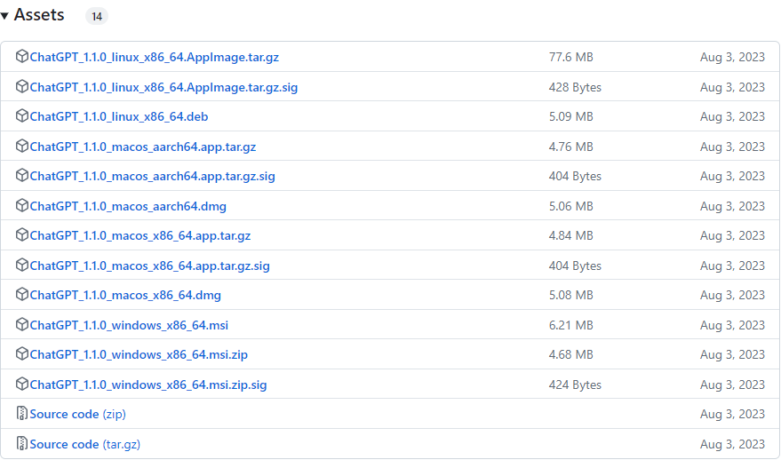

# ChatGPT_in_Rasa

## Project Name

ChatGPT_in_Rasa

## Project Introduction

Call ChatGPT API in the rasa project.

* ChatGPT training process

  

* Rasa framework

  

## Project Structure

* `/assets`
Relevant image resources required for the `README.md` file

* `/code`
Rasa project code

## Preparation Work

* Download and install [ChatGPT Desktop](https://github.com/lencx/ChatGPT/releases) (optional).

  

* Register a [ChatGPT](https://chat.openai.com) account.

  

* Acquire ChatGPT API Key.
  * Visit [OpenAI's Platform](https://platform.openai.com/api-keys) and log in to your OpenAI account.
  * Once logged in, locate the option to create a new secret key. This is labeled as "Create new secret key."

    

  * You will be prompted to input some information.
    * Name: Give your API key a descriptive name for easy reference.
    * Project: Choose the project you're working on or creating the API key for.
    * Permissions: Select "all" to grant full permissions unless you have specific limitations in mind.
    * Create Secret Key: After providing the necessary information, proceed to create the secret key.

      

  * Once the key is generated, make sure to save it securely. You'll typically get a string of characters representing your API key. This key is sensitive information and should be treated like a password.

    

By following these steps, you should have successfully obtained your ChatGPT API Key, allowing you to access OpenAI's services programmatically. Below, we will introduce how to configure the environment for a Rasa project.

## Environment Configuration

* Download and install Anaconda from the [official website](https://www.anaconda.com).

  

* Find Anaconda installation directory. Locate the directory where Anaconda is installed on your system. This is typically something like `C:\Users\<Username>\Anaconda3` on Windows.

* Set Anaconda environment variables.
  * Open the start menu and search for "Environment Variables" or navigate to `Control Panel` > `System and Security` > `System` > `Advanced System Settings` > `Environment Variables`.
  * In the environment variables window, under system variables, click on "New" and add the following variables:
    * Variable name: `ANACONDA_HOME`
    * Variable value: path to your Anaconda installation directory (e.g., `C:\Users\<Username>\Anaconda3`)
  * Next, find the "Path" variable in the list of system variables, select it, and click on "Edit".
  * Add the following two entries to the list of paths:
    * `%ANACONDA_HOME%`
    * `%ANACONDA_HOME%\Scripts`
  * Click "OK" to save the changes and close all windows.
  * Restart your computer to apply the changes.

* Verify installation. After setting up the environment variables, open a new terminal or command prompt window and type `conda --version` to verify that Anaconda is now in your system's PATH and accessible from any directory.

  

* Update conda packages.

  ```bash
  conda update --all
  ```
  This command updates all packages in the current conda environment to the latest versions available.

* Create a new conda environment for Rasa.

  ```bash
  conda create -n rasa python=3.9
  ```
  This command creates a new conda environment named "rasa" with Python version 3.9.

* Activate the Rasa environment.

  ```bash
  conda activate rasa
  ```
  This command activates the newly created "rasa" environment, allowing you to work within it.

  

* Install Rasa using pip.

  ```bash
  pip install rasa
  ```
  This command installs the Rasa package along with its dependencies into the active conda environment using pip.

* Install openai package.

  ```bash
  pip install openai==0.28
  ```
  This command installs a specific version (0.28) of the openai package into the active conda environment using pip. Adjust the version number as needed.

Thus far, the environment configuration for the Rasa project has been completed. Next, we will introduce how to start a Rasa project.

## Run Rasa Project

* Open the Rasa project directory (`code` folder) in Visual Studio Code.

  

* Open an integrated terminal in Visual Studio Code. You can do this by navigating to the top menu and selecting `View` > `Terminal`, or by using the shortcut.

* Train the model.

  ```bash
  rasa train
  ```

  In a terminal, run this command to train the model.

* Run actions server.

  ```bash
  rasa run actions
  ```

  In a terminal, run this command to start the Rasa actions server.

  

* Start Rasa shell.

  ```bash
  rasa shell --endpoints endpoints.yml
  ```

  In a **new** terminal, run this command to start the Rasa shell and interact with the trained model.

  

* Call ChatGPT API in the rasa project.

  The project provides two sample functionalities: **Simulating the Presence of a Beloved Pet** and **Generating a Copywriter for WeChat Moments**. These features enable users to experience interactions that are both emotionally supportive and creatively enriching. Below is a brief description of each feature and how you can experience them by invoking the ChatGPT API within our Rasa project.

  * **Simulating the Presence of a Beloved Pet**

    ***Prompt:** Dear ChatGPT, I recently lost my beloved puppy, Milo. He was an incredibly lively and affectionate golden retriever who always greeted me with boundless energy and wagging tail as soon as I walked through the door. His favorite activity was to fetch tennis balls in the park and he would often snuggle next to me when I watched TV. Could you help me feel his presence again by simulating a conversation I might have had with him when I come home from work?*

    ```
    Your input -> /new_chat_Pet
    ```

  * **Generating a Copywriter for WeChat Moments**

    ***Prompt:** Hello ChatGPT, I need your assistance in crafting a post for WeChat Moments. I want the post to radiate a sense of nostalgia and warmth, reflecting on a recent family gathering in a literary style. The mood should be gentle and evocative, using vivid imagery to convey the soft glow of sunset that bathed our reunion in a golden light. Please let your imagination flow freely and create a text that encapsulates the emotions of joy mixed with a longing for these moments to last forever. Thank you!*

    ```
    Your input -> /new_chat_WeChat
    ```

  Give it a try and see how it works!

## Relevant Resources

* [Awesome ChatGPT Prompts](https://github.com/f/awesome-chatgpt-prompts) Some examples of ChatGPT prompts.

* [Rasa Custom Actions](https://rasa.com/docs/rasa/custom-actions) Implementation guide for Rasa custom actions.

* [Additional Explanation](Additional_Explanation.md)
  * Design of Prompts
  * The Difference and Connection between `openai.Completion.create` and `openai.ChatCompletion.create`

## Documentation Update Date

2024-04-25