# Integrated Library Service System Design Documentation

## 1 内容分析

### 1.1 场景描述

#### 1.1.1 设计背景

图书馆综合服务系统旨在通过数字化解决方案提高服务效率和质量，扩展服务覆盖范围，优化资源管理，并极大提升用户体验。系统整合了图书借阅、场地预约、文献检索等多种服务，支持远程访问和操作，使图书馆能够更有效地满足广泛用户的需求。此设计不仅适应了数字化时代的要求，也为图书馆提供了一个现代化、高效、便捷的服务平台，有助于促进学术和教育资源的获取与共享。

#### 1.1.2 目标用户群体与角色设定

本图书馆辅助系统主要面向以下用户：

* **学生**：学生是图书馆服务系统的主要使用者之一。系统提供了图书借阅、文献检索等功能，方便学生进行学习资料的查找和借阅，支持他们的学术研究和课程学习需求。学生也可以选择参观展览拓展视野。
* **教职员工**：教职员工也是系统的重要用户，他们除了借阅和检索文献外，还可能需要使用系统来预约研讨会和讲座的场地，或是管理和参与学术展览。
* **校外访客**：对于不是学校的正式成员但希望使用图书馆资源的访客或社区成员，该系统同样开放，但有部分空间预约功能以及检索功能不予开放。展览预约功能可以对公众开放，吸引更多社区互动和参与。
* **图书馆管理人员**：图书馆的行政人员可以利用这个系统来监控和管理图书馆的运营情况，如资源利用率、借阅情况统计等，以便更有效地调配图书馆资源和服务。其认证登陆过后，空间预约与借阅功能会变成图书馆人流量统计以及书籍借阅情况统计方便管理。

   | 职业 | 姓名 | 年龄 | 学号 / 工号 | 学院 / 部门 | 照片 | 
   | :---: | :---: | :---: | :---: | :---: | :---: |
   | 普通学生 | 张三 | 21 | 2159999 | 软件学院 |  |
   | 教授 | 罗老师 | 30 | 21999 | 法学院 |  |
   | 图书馆管理员 | 张女士 | 32 | 14999 | 图书馆管理部门 |  |
   | 校外访客 | 徐茜 | 20 | 无 | 无 |  |

#### 1.1.3 使用场景

* **学生进行课程相关资料搜索和借阅**：学生为完成课程作业或准备考试，通过系统搜索和借阅相关的书籍和文献。学生可以在线检索所需资料，并预约或直接借阅图书。
* **学生预约研讨会场地或自习**：学生为完成课程作业或准备考试，可以预约空间进行自习；或是预约研讨室进行讨论、进行线上面试等。
* **各类用户参与参观展览或学术研讨**：用户通过系统预约参观学术展览的时间和票务，系统提供的展览预约功能可吸引社区成员参与图书馆的文化和学术活动。
* **图书馆管理人员进行资源和服务管理**：图书馆管理人员利用系统进行资源利用率和借阅情况的统计分析，以优化图书馆的运营策略和资源分配。管理人员也可以通过系统监控场地使用情况，确保资源的有效利用。
* **图书馆行政人员监控和调整图书馆开放策略**：管理人员根据统计数据和用户反馈，调整图书馆的开放时间、空间布局和服务策略，以更好地服务于用户。
* **自助图书借还和续借操作**：用户通过系统界面自助完成图书的借阅、归还及续借操作，减少人工介入，提高服务效率。

#### 1.1.4 用户体验目标

* **无缝访问与操作简便性**：
  * 确保系统界面直观易用，所有用户（尤其是学生和教职员工）能够轻松访问和操作所有功能，如文献检索、图书借阅和场地预约。
  * 提供多语言支持和无障碍访问功能，确保所有用户群体都能舒适使用系统。
* **快速准确的信息检索**：
  * 为学生和研究人员提供高效的搜索工具，确保他们可以快速准确地找到所需的学术资料和书籍。
  * 搜索结果应提供充足的筛选和排序选项，以便用户能够根据不同需求找到最相关的信息。
* **资源管理和预约系统的高效性**：
  * 对于需要预约场地和参与展览的教职员工及校外访客，确保预约系统响应迅速、操作简便，且能准确反映可用资源状态。
  * 系统应能自动发送预约确认和提醒通知，提高用户的方便性和满意度。

### 1.2 需求分析

#### 1.2.1 功能需求分析

1. **图书检索与借阅系统**
   * 允许用户通过关键词、作者、标题等多种方式搜索图书和文献。
   * 提供图书详情页面，显示书籍状态（可借、已借出、预约等）。
   * 支持在线借阅和预约图书，以及图书续借和归还功能。
2. **场地预约系统**
   * 允许用户预约不同类型的场地，如研讨室、自习室等。
   * 提供实时的场地可用性信息和预约管理。
   * 自动发送预约确认和提醒通知。
3. **文献检索服务**
   * 提供高级文献检索工具，支持多种检索方式和过滤器，方便用户快速找到需要的学术资源。
   * 链接到电子资源的直接访问（如电子书籍和学术论文）。
4. **展览和活动预约功能**
   * 允许用户查看即将进行的展览和活动的详情，并进行在线预约。
   * 管理展览票务和访客流量。
5. **图书馆资源管理**
   * 使图书馆管理人员能够监控图书和资源的流通情况，包括借阅统计和资源利用率。
   * 提供书籍和资源的管理界面，用于添加、修改或删除库存信息。
6. **报告和数据分析工具**
   * 为图书馆管理人员提供强大的报告功能，包括生成借阅统计、用户活动和资源利用率报告。
   * 支持数据的导出功能，以便进行更深入的分析。

#### 1.2.2 可用性需求分析

1. **响应式设计**：
   * 界面应适应不同的设备和屏幕尺寸，包括桌面电脑、平板和手机。这意味着设计应采用响应式布局，确保所有用户都能无缝访问系统。
   * 动态元素（如下拉菜单、弹出窗口）应根据设备的交互方式（点击或触摸）进行优化。
2. **一致性**：
   * 设计中的元素（如颜色方案、字体、按钮样式）在整个应用中应保持一致，以减少用户的学习负担。
   * 相似功能的操作方式应统一，以增强用户的预期一致性，减少操作错误。
3. **无障碍访问**：
   * 界面设计应遵守无障碍访问标准，包括高对比度的文本和背景、适用于屏幕阅读器的标签和指令、以及键盘导航的支持。
   * 提供字体大小调整的功能，以帮助视力不佳的用户更好地阅读文本。
4. **美观和现代化的视觉设计**
   * 使用现代的UI设计元素，如扁平化图标、渐变色背景等，以吸引用户并提供愉悦的视觉体验。
   * 确保视觉设计符合图书馆的品牌形象和用户预期，如使用稳重、学术性强的颜色和图案。

### 1.3 预期效果

#### 1.3.1 界面设计与用户体验

1. **直观的用户界面**：一个清晰、无杂乱的界面设计是提高用户体验的首要条件。设计时应考虑到用户的操作习惯和视觉引导，确保用户能够自然地从一个功能流向另一个功能，无需过多的学习成本。
2. **响应式布局**：系统界面需要在各种设备上表现良好，包括台式机、笔记本、平板及手机。响应式设计确保用户在任何设备上都能获得一致的体验。
3. **美观的视觉风格**：良好的视觉设计不仅可以吸引用户，还可以传递图书馆的品牌价值。使用现代的UI元素和合适的颜色搭配可以提高用户的整体满意度。

#### 1.3.2 功能实用性

1. **借阅功能**
   * 提高借阅效率：通过自动化的借阅和归还流程，用户可以快速借出和归还书籍，减少排队等候时间。
   * 实时库存更新：系统能够实时显示书籍的可用状态，帮助用户了解哪些书籍可以立即借阅，哪些正在借出状态。
   * 提醒和通知：用户会收到借书到期提醒，降低逾期归还的情况，同时也可以选择自动续借功能，增加用户便利性。
   * 借阅历史记录：用户可以轻松查看自己的借阅历史，帮助他们回顾和管理所借的书籍。
2. **空间预约功能**
   * 优化空间利用：通过在线预约系统，图书馆可以更有效地管理其空间资源，确保空间得到充分利用。
   * 方便快捷的预约体验：用户可以随时查看各种空间的可用性并进行预约，无需前往图书馆柜台进行登记。
   * 减少冲突和重复预约：系统自动处理预约请求，避免人为错误导致的场地预约冲突。
   * 提升活动质量：为研讨会、讲座等活动提供合适的场地，确保活动顺利进行。
3. **展览预约功能**
   * 增加展览参与率：通过简化的在线预约流程，吸引更多访客预约参观展览，提高展览的公众参与度。
   * 文化推广：通过展览预约系统，图书馆能够更有效地推广文化活动，增强社区的文化生活。
   * 提供定制化信息：系统可以根据用户的兴趣和历史参与记录推荐即将到来的展览，增强用户体验。
   * 高效的访客管理：通过预约系统管理访客流量，避免过度拥挤，确保展览的观赏质量。
4. **文献检索功能**
   * 提高检索效率和精确度：强大的搜索引擎使用户能够快速、精确地找到所需文献，减少时间浪费。
   * 支持高级搜索功能：用户可以通过多种搜索条件组合（如作者、出版年份、主题等）来精确查找文献。
   * 增强研究能力：便捷的文献检索功能支持学术研究和知识探索，为用户提供必要的学术支持。
   * 集成访问学术数据库：系统可链接到外部学术数据库和资源，为用户提供更广泛的学术资源访问。

## 2 功能生成

### 2.1 功能流程设计

1. **空间预约界面**

   ```mermaid
   graph TD
   A[首页点击空间预约图标] --> B[研习室预约]
   A --> C[阅览室预约]
   C --> D[选择楼层和座位]
   D --> E[预约成功]
   B --> F[单人研习室]
   B --> G[多人研习室]
   F --> H[选择时间房间]
   H --> E
   G --> I[选择时间房间]
   I --> J[登记多人信息]
   J --> E
   ```

2. **图书借阅界面**
   
   ```mermaid
   graph TD
   A[首页点击图书借阅图标] --> B[图书借阅须知]
   B --> C[借阅书籍]
   B --> D[归还书籍]
   B --> E[续借书籍]
   C --> F[选择书籍名称、ISBN编号和借阅时长]
   D --> G[选择书籍名称、ISBN编号]
   E --> H[选择书籍名称、ISBN编号和续借时长]
   F --> I[成功]
   G --> I
   H --> I
   ```

3. **展览预约界面**

   ```mermaid
   graph TD
   A[首页点击展览预约图标] --> B[在缩略图中点击感兴趣的展览]
   B --> C[查看展览详细信息]
   C --> D[选择时间]
   D --> E[成功]
   ```

4. **文献检索界面**
   
   ```mermaid
   graph TD
   A[首页点击文献检索图标] --> B[筛选按钮进行筛选]
   B --> C[搜索框输入文献]
   C --> D[点击搜索]
   ```

### 2.2 界面简易设计

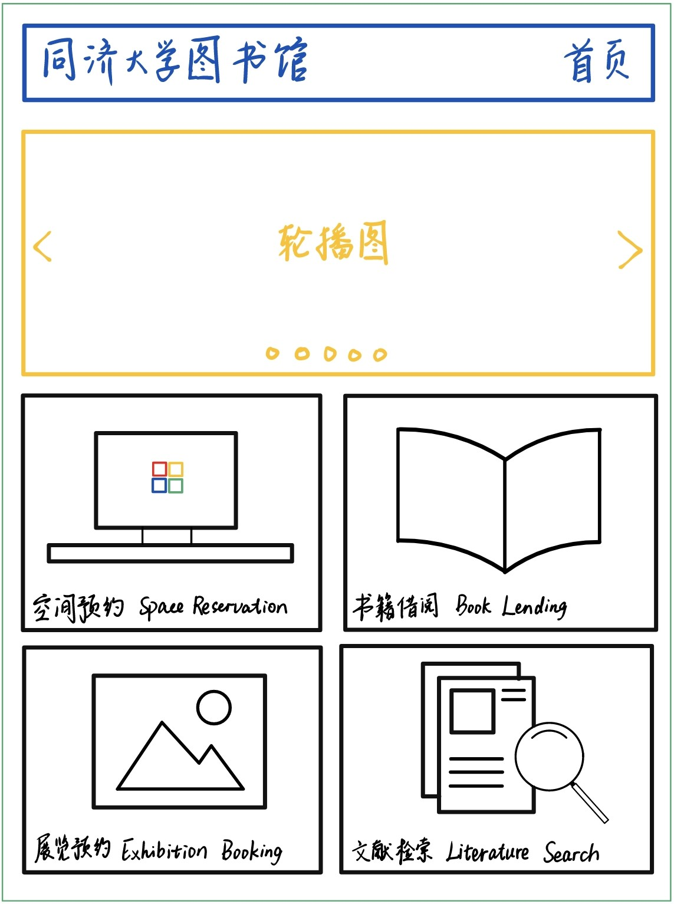

## 3 设计过程

### 3.1 设计平台

* 操作系统：Windows 11
* 设计平台：[Figma](https://www.figma.com)

### 3.2 设计理念

这款图书馆服务系统的设计理念旨在通过用户中心、功能整合的方式提供直观、易用的服务平台，支持无障碍访问和多语言，确保所有用户均可平等利用图书馆资源。系统强调实时的资源管理和操作效率，促进学术与文化交流，并采用现代技术保证系统的前瞻性和扩展性。整体目标是创造一个高效、全面并能促进知识分享与文化发展的图书馆服务环境。

#### 3.2.1 设计风格

系统采用了现代、简洁且专业的视觉风格，非常适合于教育和学术环境。使用了清晰的图标和直观的界面布局，以提高用户体验和易用性。界面风格符合校园文化的氛围，通过使用校徽和校园景观图片，加强了用户的归属感和品牌认同。

#### 3.2.2 布局设计

布局设计注重用户导航的直观性和逻辑性，主页和各功能页面均采用了清晰的导航结构，易于新用户理解和操作。在每个服务功能，如图书借阅或研习室预约，均提供了直接的视觉线索（如按钮和图标），用户可以快速从主页访问到具体功能。

#### 3.2.3 配色方案

配色方案使用了以白色为主，辅以蓝色和浅灰色，创建了一个清爽和舒适的视觉环境。这种配色不仅有助于提升文本的可读性，也使得应用程序看起来更加现代和吸引人。蓝色作为主色调，能够引起人们的信任感和稳定感，非常适合于教育和学术类应用。

#### 3.2.4 可访问性

* **字体大小和对比度**：使用了适中的字体大小和高对比度的色彩，确保了视觉上的清晰度，方便所有用户阅读。
* **触摸友好的界面**：按钮和链接的尺寸足以容纳触摸操作，适合在移动设备上使用。
* **简化的用户流程**：在功能设计上尽量减少用户输入，如使用日期选择器和预定按钮，减轻用户操作负担。
* **清晰的反馈**：操作如预约或搜索后，应用会提供明确的反馈，如确认页面和提示信息。

### 3.3 原型界面设计

#### 3.3.1 登陆和首页界面

在设计登录和首页界面时，优先考虑了用户体验，采用简洁且具有现代感的风格，通过直观的图标和有限的文字强调功能导向，确保用户可以轻松地识别和访问需要的服务。同时，设计中巧妙融入文化和情感元素，如传统艺术和校园景观，以增强视觉吸引力和情感共鸣，提升用户的整体满意度和效率。这种方法展现了现代界面设计中注重视觉层次感和用户交互体验的普遍趋势。

登陆和注册界面设计思路如下：

1. **用户体验优先**：界面设计重点放在易用性上，确保每个用户都能快速理解和操作界面。通过减少冗余的设计元素，使用清晰的字体和高对比度的色彩，来提高界面的可读性和操作的直观性。
2. **功能导向设计**：设计师使用简洁的图标和精准的标签文字来指示不同的功能模块，如书籍借阅、空间预约等，确保用户在第一时间内就能识别所需功能。这种方法减少了用户在应用内的搜索时间，提高了整体的效率和用户满意度。
3. **视觉层次感**：界面利用色彩、图形大小和布局来创造清晰的视觉层次，使得主要功能和次要信息有良好的区分。例如，主要功能采用更大的图标和更醒目的颜色，而背景则保持简洁，以突出重点内容，从而引导用户的视线和操作流程。
4. **适应性和普适性**：设计考虑到多种使用场景和用户设备，确保应用界面在不同的屏幕尺寸和操作系统上均能保持良好的可用性和一致的视觉效果。此外，界面的响应式设计使得无论用户在手机、平板还是电脑上访问，都能获得优质的用户体验。

登陆界面设计展示如下：

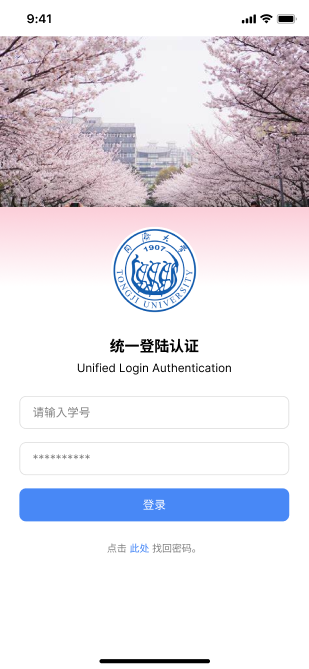

主页界面设计展示如下：

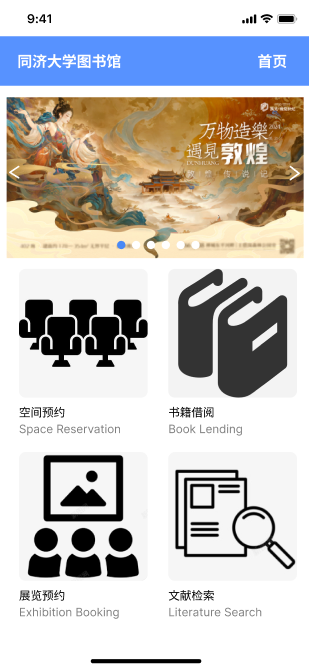

#### 3.3.2 空间预约界面

座位预约系统的界面设计体现了清晰的功能导向和简洁的视觉风格，通过有效的交互元素和易于导航的布局，确保用户能快速理解并执行操作。设计中使用了蓝色和白色的色彩搭配，增加了界面的清晰度和美观性。此外，系统通过图形化的座位布局图直观显示座位状态，提高了选择的效率。整体上，这种设计旨在提升用户体验，使得预约过程既直观又高效。

日历界面设计思路如下：

1. **直观性**：系统设计强调从用户首次接触界面开始的直观体验。通过大尺寸的图标和简单的语言标签（如“预约会议室”或“选择座位”）来引导用户操作。此外，采用视觉突出的滑动轮播或弹出菜单，确保用户可以快速找到他们想要执行的主要任务，无需深入浏览或查找。
2. **用户导向**：界面设计充分考虑用户操作的流畅性和逻辑性。从进入应用到完成预约，设计上采用分步骤流程，每一步都通过清晰的指示和简单的操作界面进行引导。例如，在预约流程中，系统会自动过滤并显示用户可以预约的日期和时间，减少用户的选择负担。
3. **高效的信息展示**：在展示空间可用性时，系统利用颜色编码或图标来标示不同状态（如绿色表示可用，红色表示已满），并且提供动态更新的实时数据。通过交互式的图表或地图，用户可以直观地看到每个会议室或座位的具体位置和状态，使得选择过程既直观又高效。
4. **适应性**：设计考虑到多平台使用的需求，确保界面在不同设备上都能提供一致的体验。适应性设计包括响应式网页布局和触控友好的界面元素，如足够大的按钮和适当间距的布局，以适应手指操作，无论是在小屏手机还是大屏平板上。
5. **反馈机制**：设计中嵌入了即时反馈机制来提升用户的操作确信度。例如，当用户选择一个座位或会议室后，系统会通过颜色变化、弹出窗口或震动反馈立即响应用户的操作，确保用户明白他们的选择已被系统记录。
6. **美观与实用并重**：界面设计旨在创造一个既美观又实用的环境。使用和谐的色彩搭配（如柔和的蓝色调和明亮的白色背景）和现代化的设计元素，如扁平化图标和圆润的按钮，不仅使界面看起来更加现代，也提高了界面的总体可读性和用户的视觉舒适度。

日历界面设计展示如下：

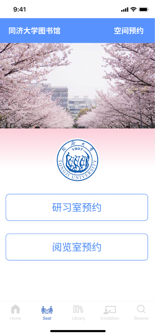

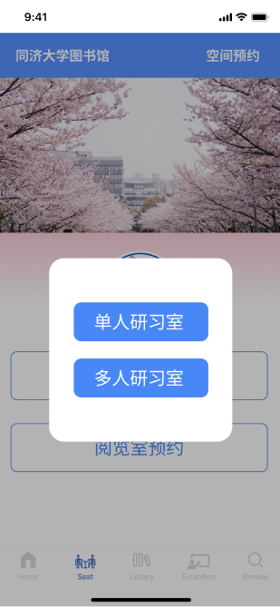

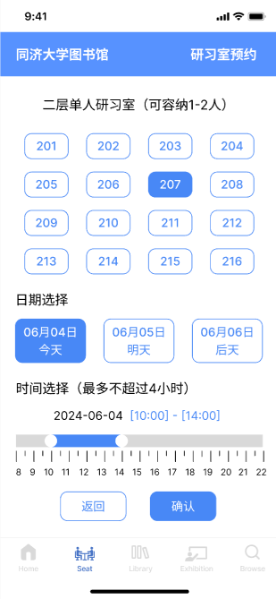

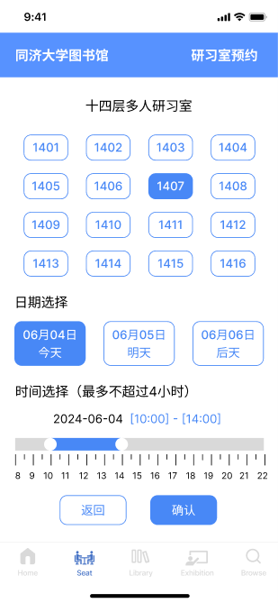

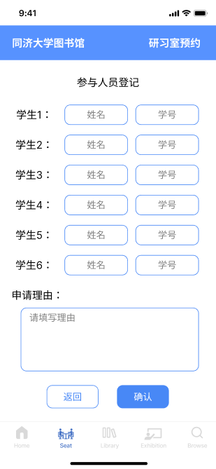

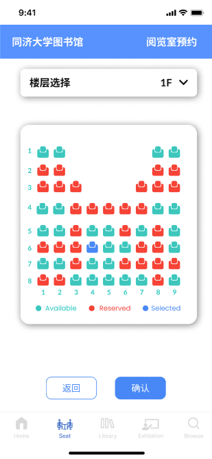

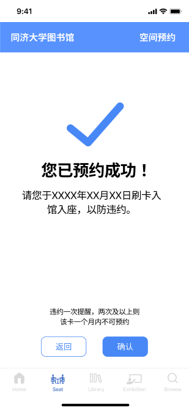

#### 3.3.3 图书借阅界面

图书借阅功能的设计思路体现在其简洁直观的用户界面和高效的操作流程中。设计上采用了清晰的步骤划分，如输入书名、ISBN号和选择借阅日期等，每个步骤都通过简单易懂的输入框和下拉菜单完成，使用户能够迅速填写或选择相关信息。界面采用了统一的蓝白色调，保持了视觉上的一致性和专业性，同时底部的导航栏和明确的按钮设计（如“提交”和“取消”）进一步提升了用户的操作便捷性。此外，系统在设计上也考虑到了错误处理和用户反馈，例如，在信息输入有误或不完整时，会有提示信息确保用户能正确和完整地完成每一步操作。整体而言，这个图书借阅功能的设计优化了用户体验，使借阅过程既高效又用户友好。

图书借阅界面设计思路如下：

1. **简化操作流程**：设计上通过清晰的步骤划分来简化用户的操作流程，例如，首先选择书籍名称或输入ISBN号码，然后选择借阅日期，最后提交请求。这种线性的操作流使用户容易理解并遵循，减少操作的复杂性。
2. **直观的用户体验**：界面使用统一的蓝白色调，视觉上简洁而清新，有助于提高用户的集中度。每个操作步骤都配有明确的输入框、选择器或按钮，使得信息的填写和选择变得非常直观。
3. **明确的指示与反馈**：设计中包含了对用户操作的即时反馈，如输入错误信息时，系统会提供错误提示或要求用户补充必要的信息。这种反馈机制确保用户能够正确完成每一项操作，避免因信息错误而导致的借阅失败。
4. **便携性与访问性**：界面布局考虑到了用户的便捷性和访问性，通过底部固定的导航栏和容易触达的操作按钮（如“提交”和“取消”），确保即使在移动设备上也能轻松操作。
5. **适应多种用户需求**：设计允许用户通过多种方式搜索和选择书籍，既可以通过书名也可以通过ISBN号进行搜索，满足不同用户的偏好和需求。

图书借阅界面设计展示如下：

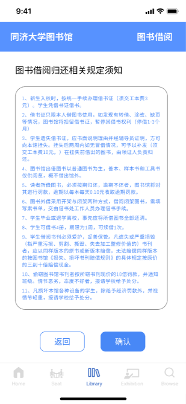

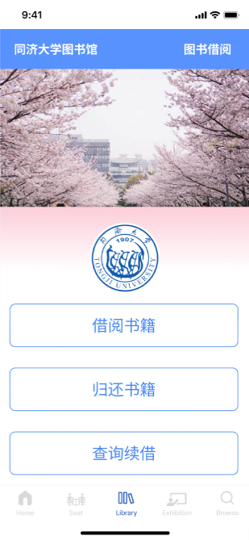

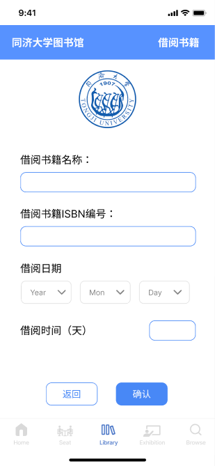

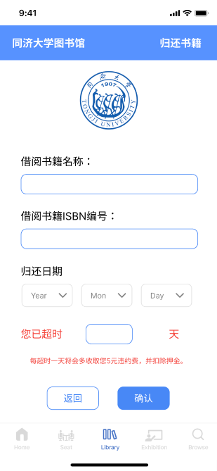

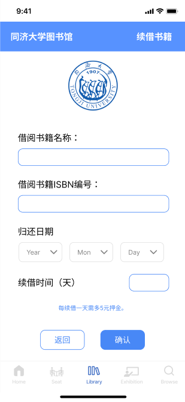

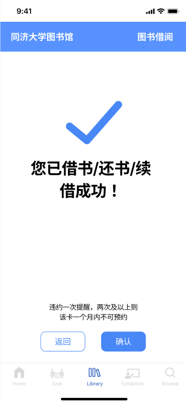

#### 3.3.4 展览预约界面

展览预约功能的设计风格注重清晰和视觉吸引力，通过使用生动的图片和简洁的文本来增强用户体验。每个展览的入口都配有代表性的图像和简短的标题及描述，使用户能够快速获取关键信息并作出决定。此外，设计中的字体选择和颜色搭配保持了一致性，确保了界面的专业性和美观性。界面布局整洁，信息展示有序，如展览的可用性和剩余名额直观显示，方便用户理解和操作。总体上，展览预约功能的设计既实用又具吸引力，有效地指导用户通过几步简单的操作完成预约流程。

展览预约界面设计思路如下：

1. **视觉吸引力**：利用高质量的展览图片作为每个展览条目的主视觉，吸引用户的注意力。配合每张图片，都有相应的展览标题和简短描述，旨在快速传递展览的主题和内容，提升用户兴趣。
2. **信息清晰性**：设计强调信息的清晰呈现，通过简洁的界面布局，将关键信息（如展览名称、描述、参观时间、剩余名额）结构化展示，确保用户可以轻松地找到并理解这些信息。
3. **操作简便性**：提供直观的操作按钮（如“预约”和“取消”），并放置在容易访问的位置，以便用户可以无障碍地进行预约操作。设计上考虑到了用户的操作习惯，确保界面的友好性和易用性。
4. **反馈及提示**：在用户进行操作如预约或取消时，系统提供即时反馈，例如通过弹出通知确认操作成功或显示错误信息，这帮助用户确认自己的操作结果，增加使用的信心。
5. **动态信息更新**：展览的剩余名额等动态信息实时更新，反映当前的可预约状态，这不仅提高了信息的准确性，也增强了系统的响应能力。
6. **一致性和专业性**：在界面设计中保持一致的风格和色彩，使用专业的字体和布局，旨在创造一个整洁和专业的用户环境，使用户在使用应用时感受到舒适和信任。

展览预约界面设计展示如下：

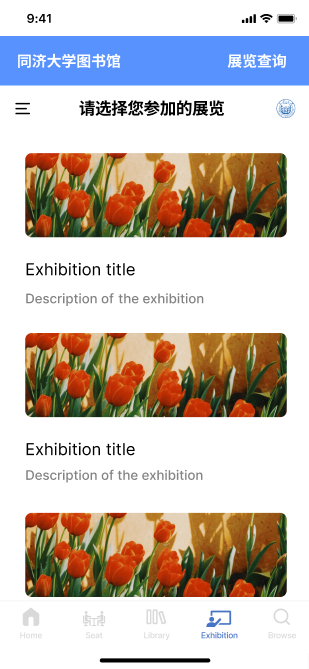

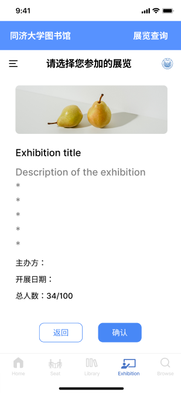

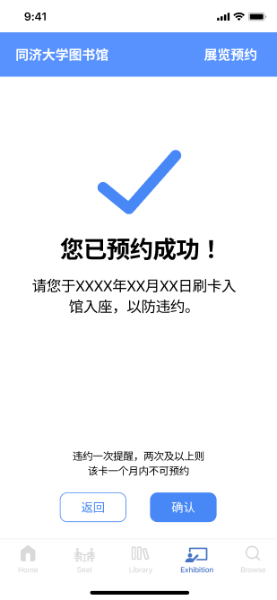

#### 3.3.5 文献检索界面

整体采用了蓝白色调，为用户提供清晰的视觉体验。界面顶部是一个搜索框，配有清晰的放大镜图标，便于用户快速识别搜索功能。下方是多个分类标签，通过圆形图标和简洁的文字标签来分类内容，使用户能够轻松地选择不同的阅读类别。整个设计强调了功能性和易用性，同时保持了视觉上的整洁和直观。

文献检索界面设计思路如下：

1. **清晰的布局**：顶部的搜索框明确提示用户可进行搜索，与许多应用保持一致，使用户直觉操作。分类标签位于搜索框下方，直接展示，便于用户快速浏览和选择。
2. **视觉风格**：采用蓝白色调，色彩对比适中，给人以清新、专业的感觉。图标和文字使用统一的设计风格，简洁而现代，符合移动应用的审美趋势。
3. **功能区分**：界面中的图标和文字清晰区分了各种功能模块，如“我的设备”、“会议”和“学术期刊”等，用户可以快速找到所需内容。通过简单的图形和少量文字，提高了界面的可读性和操作便捷性。
4. **用户引导**：设计中包括了底部的导航栏，包括“首页”、“坐位”、“图书馆”、“展览”和“浏览”等选项，进一步指导用户进行更深层次的探索。导航栏采用直观的图标和文字，帮助用户快速识别并切换到不同的页面。
5. **交互体验**：界面的每个元素都考虑到触控友好性，大小适中，方便在移动设备上操作。文字和图标的间距、布局都考虑到了触摸屏的使用习惯，保证操作的流畅性。

文献检索界面设计展示如下：

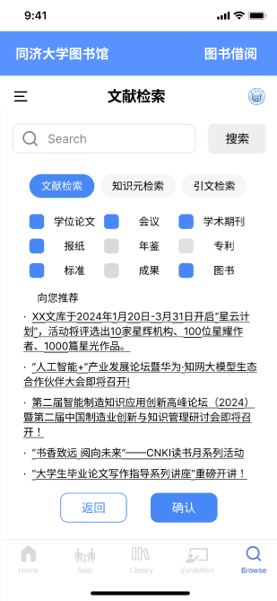

## 4 操作流程

应用的操作流程如下：

1. **空间预约界面**：用户点击空间预约图标即可进入空间预约界面。用户可以选择研习室预约或阅览室预约。研习室可以说话，更适合有讨论等发声需求的同学；阅览室是可以看书、自习的地方，需要保持安静。点击研习室预约的选项会弹出“单人研习室”和“多人研习室”两个选项，用户可以按需选择。若选择多人研习室，需要登记人员名单和申请理由。阅览室预约可以选择楼层和不同座位。点击返回返回上一级，点击确认出现预约成功界面。可以在此界面返回首页。
2. **图书借阅界面**：用户点击图书借阅图标即可进入图书借阅界面。首先用户需阅读图书借阅须知，点击返回可返回上一级，点击确定可选择借阅书籍/归还书籍/续借书籍，点击后分别由不同的提示页面，完成后会有成功借阅/归还/续借提醒。
3. **展览预约界面**：用户点击展览预约图标即可进入展览预约界面。该界面有各个展览的缩略信息，点进去即可得知详细信息，点击确认即可预约成功。
4. **文献检索界面**：用户点击文献检索图标即可进入文献检索界面。首页会提示一定的活动信息，在搜索框内输入即可进行搜索，下方可进行筛选。

## 5 应用展示

### 5.1 座位预约展示

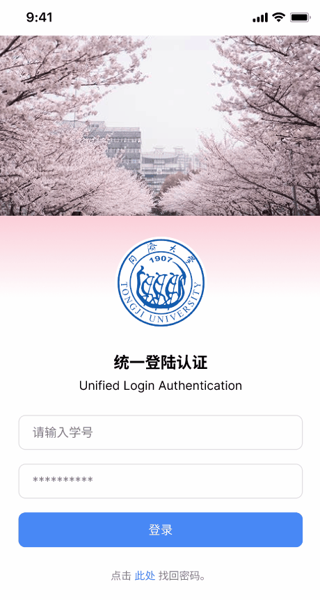

### 5.2 书籍借阅展示

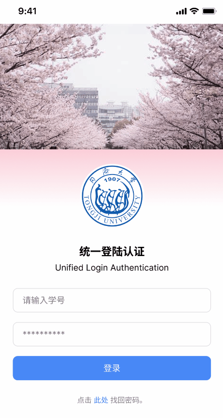

### 5.3 展览预约展示


### 5.4 文献搜索展示


## 6 设计评估

### 6.1 设计优势评估

#### 6.1.1 功能评估

1. **多功能集成**：应用整合了多种服务，包括图书借阅、阅览室和会议室预约、展览信息查询等，用户可以在同一个平台上访问这些服务，无需切换多个应用或平台。这种一站式服务模式为用户提供了极大的便利，有效节省了用户的时间和精力。
2. **直观的用户界面**：应用的用户界面（UI）设计专注于直观操作，通过清晰的图标、简洁的菜单和明确的指令按钮，使功能一目了然。例如，借书和预约的选项通过大图标直接呈现，使用户能够轻松理解并迅速找到所需功能。
3. **响应式设计**：该系统的设计适应了各种屏幕和设备，确保用户在不同的设备上如智能手机、平板电脑或笔记本电脑上均可获得优质体验。响应式设计意味着布局和内容会根据用户的设备屏幕尺寸自动调整，提高了界面的可用性和访问效率。
4. **实时信息更新**：系统提供实时更新的信息，如可预约的阅览室状态、书籍借阅可用性等。这保证了用户在做决策时拥有最新的信息，避免了预约冲突和资源浪费，增加了系统的效率和用户的满意度。
5. **个性化服务**：应用支持高度个性化的服务配置，如用户可以选择特定的日期和时间进行阅览室预约，也可以根据个人的借阅历史推荐书籍。这种个性化体验提升了用户的参与感和应用的实用性。
6. **操作反馈**：在用户完成任何操作后，系统都会提供明确的反馈，如预约成功的通知或是操作错误的解释。这种即时反馈机制不仅提升了用户操作的确定性，还增强了用户对系统的信任。
7. **美观的视觉设计**：应用采用了吸引人的视觉设计，如使用校园美景作为背景，提供了视觉上的愉悦感。良好的视觉设计可以提升用户的整体体验，增加用户使用应用的意愿。
8. **安全性和隐私**：应用通过统一的登录认证系统来保护用户的个人信息安全，防止数据泄露。安全性的增强不仅保护了用户的隐私，也符合现代网络应用对数据保护的严格要求。

#### 6.1.2 用户交互评估

1. **简单明了的界面设计**：应用程序采用了最小主义的设计风格，通过限制使用多余的装饰和复杂的布局，保证了用户界面的清晰性。这样的设计不仅有助于减少用户的认知负担，还可以加快页面加载速度，提高整体的用户体验。
2. **直观的导航系统**：导航元素（如图标和文字标签）被设计得直观易懂。例如，使用书本的图标表示“借书”功能，使用椅子的图标表示“座位预约”。这种符号化的表示方法可以帮助用户快速识别功能，减少学习使用新应用的时间。
3. **一致性**：应用在各个页面间保持了高度一致性，包括颜色方案、字体、按钮样式等，这有助于建立用户的使用习惯，减少在不同页面间切换时的迷惑感。一致的界面设计也符合用户对应用操作逻辑的预期，提高了操作的直观性。
4. **响应式交互**：应用对用户的每一个操作都提供了反馈。例如，当用户完成一个预约时，系统会立即显示一个明确的成功提示。这种即时反馈可以确认用户的操作已经被系统正确处理，从而增强用户对应用的信任。
5. **易于访问的功能**：常用功能如搜索和预约按钮设计在页面显眼的位置，通常是屏幕的中心或底部容易触及的地方，确保用户能够快速访问这些功能，无需在菜单中深入寻找，这样的布局考虑到了用户的操作便利性。
6. **错误处理和指导**：当用户操作错误时，系统不仅显示错误信息，还提供了改正的建议。这种设计不只是告诉用户出了什么问题，更重要的是引导用户如何解决问题，这是提升用户满意度和效率的重要方面。
7. **适应性强**：应用考虑到了不同用户的技能水平和设备使用习惯，通过灵活的设计来适应各种操作习惯和技术熟练度。例如，按钮大小足够大，确保触控屏用户容易点击；同时，操作流程简化，帮助不太熟练的用户也能轻松使用。
8. **多语言支持和本地化**：在多元化的校园环境中，应用程序提供多语言支持，确保不同母语的用户都能理解和使用。本地化不仅仅是翻译文字，还包括适应地方文化和习俗，使应用更贴近用户的实际需求。

### 6.2 设计劣势评估

#### 6.2.1 功能评估

1. **互动性缺乏**：缺乏互动功能，如用户之间的交流或反馈平台。在图书馆环境中，能够加入书评、用户推荐或实时的问答功能可能会大幅提升用户体验。
2. **通知和提醒系统**：应用可能未集成动态的通知系统来提醒用户即将到期的借阅或预定的活动。一个有效的通知系统可以帮助用户更好地管理他们的时间和资源。
3. **个性化和智能推荐不足**：尽管应用提供了基本的个性化服务，但在智能推荐方面可能还不够成熟。利用机器学习算法来分析用户行为并提供个性化的书籍推荐和资源建议，可以进一步提升用户满意度和应用的吸引力。
4. **多语言和文化适应性**：扩展语言支持和适应不同文化的内容展示将是提高全球用户满意度的关键。也可以适用于国外交流的学生与教授团队。

#### 6.2.2 用户交互评估

1. **界面元素密度**：对于一些用户来说，特别是在移动设备上，屏幕上元素过多可能导致界面显得拥挤，尤其是在小屏幕设备上使用时。这可能会增加用户的操作难度，尤其是对于那些不太熟悉智能手机操作的用户。
2. **交互反馈不足**：在某些操作完成后，虽然应用提供了基本的成功或错误提示，但缺少进一步的交互反馈，如动画或更详细的解释，可能会让用户对操作结果的状态不够清晰。
3. **用户个性化定制不足**：应用可能缺乏足够的个性化定制选项，如主题更换、字体调整等，这限制了用户根据个人喜好调整应用界面的能力。

### 6.3 改进方法

#### 6.3.1 功能评估改进方案

1. **增加互动性**：
   * 在应用内集成书评功能，允许用户对借阅过的书籍发表评论，并查看其他用户的评论。
   * 引入用户推荐系统，使用户可以分享他们的阅读列表和推荐书籍给其他用户。
   * 增设实时问答板块，让用户就图书内容或图书馆服务等问题进行交流和提问。
2. **完善通知和提醒系统**：
   * 开发一个包含图书到期提醒、预约开始前通知及其他活动提醒的综合通知系统，帮助用户管理他们的图书借阅和活动日程。
   * 提供自定义通知设置，允许用户选择接收通知的方式和时间，例如在图书到期前一周、一天或几小时提醒。
3. **增强个性化和智能推荐**：
   * 设计个性化推荐系统，根据用户的阅读历史和偏好，自动推荐相似书籍或作者。
   * 实现动态内容推荐，基于用户的互动（如评分、评论和阅读时间）调整推荐算法，使推荐更加准确和个性化。
4. **扩展多语言和文化适应性**：
   * 增加更多语言支持，尤其是常见的国际语言，以便于国际学生和教师的使用。
   * 考虑不同文化背景的内容展示，调整界面文本和帮助文档，确保其文化敏感性和适应性，以适应多样化的用户群体。

#### 6.3.2 用户交互评估改进方案

1. **优化界面元素布局**：
   * 精简界面元素，使用隐藏菜单和下拉列表减少屏幕占用，特别是对于移动设备优化界面设计。
   * 设计清晰的返回和主页按钮，帮助用户快速导航，避免迷失于深层次的功能菜单中。
2. **丰富交互反馈**：
   * 在用户完成操作后提供丰富的视觉和文字反馈，例如成功操作后的动画效果和详细说明，帮助用户明确了解操作结果。
   * 在出现错误或需要用户注意的操作时提供清晰、具体的指导信息，帮助用户理解如何正确完成操作。
3. **提供更多个性化定制选项**：
   * 允许用户根据个人喜好设置应用的视觉主题，如夜间模式、颜色方案和字体大小。
   * 提供界面布局定制选项，如调整信息显示的密度和布局方式，以适应不同用户的视觉和操作偏好。

## 7 文档更新日期

2024年6月10日